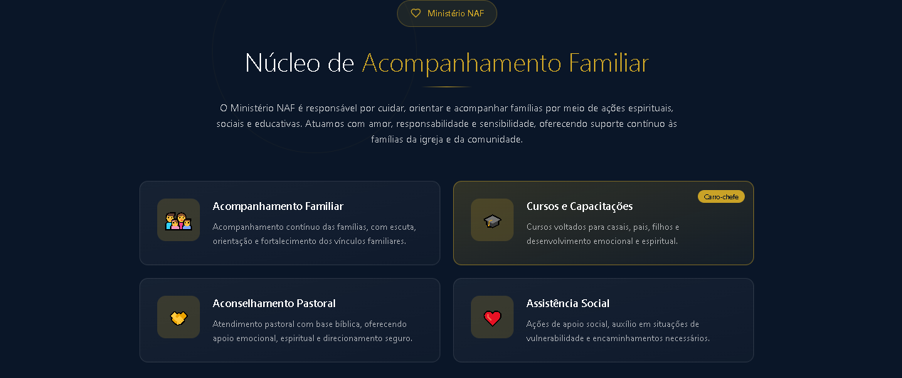
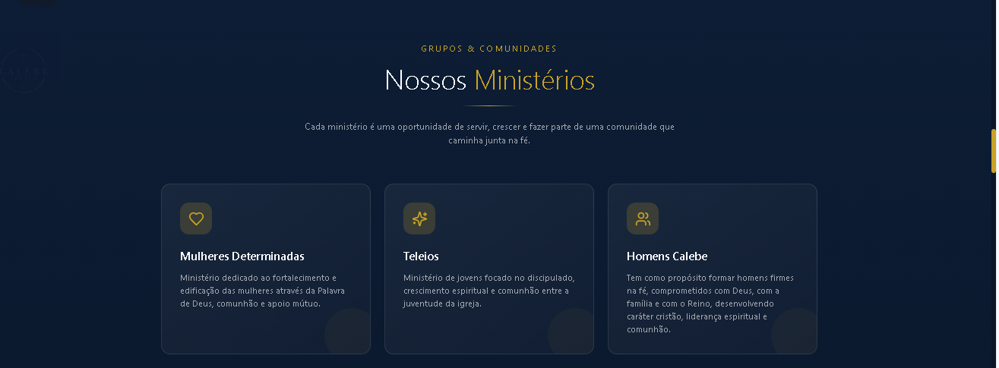
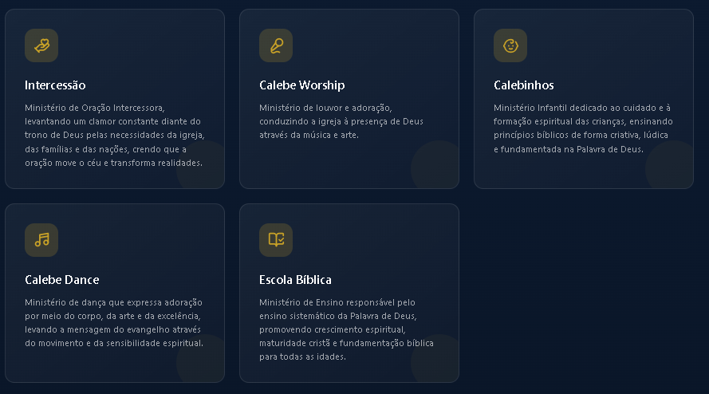
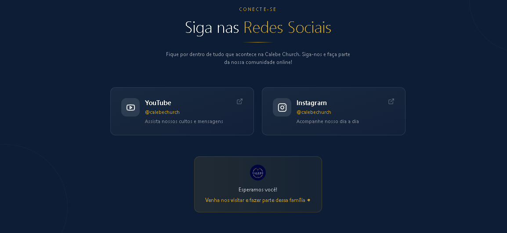
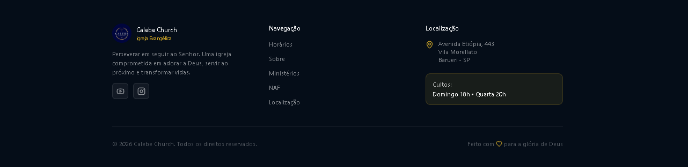

# Documento 07 — Estrutura de Wireframe e Prototipação

## Projeto

Calebe Church — Site Institucional Full-Stack

---

# 1. Objetivo do Documento

Este documento define:
- wireframes;
- estrutura visual;
- referências de interface;
- direção de layout;
- organização visual do frontend.

O objetivo é garantir consistência visual entre:
- Figma;
- prototipação;
- frontend React;
- Design System oficial.

---

# 2. Estrutura Inicial do Wireframe

Estrutura prevista inicialmente:

```txt
Navbar
HeroSection
Sobre
Cultos
Ministérios
NAF
Redes Sociais
Localização
Footer
```

---

# 3. Estratégia de Prototipação

O frontend deverá seguir:
- componentização;
- Design System oficial;
- layout responsivo;
- identidade institucional moderna;
- reutilização de padrões visuais.

---

# 4. Direção Visual Geral

O projeto utiliza:

```txt
Azul escuro
Dourado
Branco
```

Características visuais:
- institucional;
- moderno;
- elegante;
- acolhedor;
- espiritual;
- minimalista;
- responsivo.

---

# 5. Estrutura Visual das Seções

## HeroSection

Objetivo:
- gerar impacto visual inicial;
- destacar identidade da igreja;
- reforçar propósito institucional;
- direcionar navegação inicial.

Referência visual:


---

## SobreSection

Objetivo:
- apresentar missão da igreja;
- contextualizar visitantes;
- reforçar identidade institucional.

Referência visual:


---

## NAF Section

Objetivo:
- transmitir acolhimento;
- destacar suporte familiar;
- reforçar impacto social e espiritual.

Referências visuais:




---

## Ministérios Section

Objetivo:
- apresentar áreas da igreja;
- incentivar participação;
- reforçar senso de comunidade.

Referências visuais:





---

## Redes Sociais

Objetivo:
- conectar visitantes aos canais oficiais;
- incentivar engajamento digital;
- fortalecer presença online.

Referência visual:



---

## Localização

Objetivo:
- facilitar visitas presenciais;
- exibir endereço e horários;
- integrar acesso ao Google Maps.

Referência visual:


---

## Footer

Objetivo:
- consolidar navegação final;
- reforçar identidade institucional;
- apresentar informações rápidas.

Referência visual:



---

# 6. Responsividade

O frontend deverá possuir:
- adaptação para mobile;
- adaptação para tablet;
- grids responsivos;
- tipografia adaptativa;
- espaçamento proporcional.

---

# 7. Relação com o Frontend

As referências visuais documentadas neste arquivo deverão orientar:
- implementação React;
- componentização;
- estilização CSS;
- evolução visual futura.

---

# 8. Relação com o Design System

Todas as implementações deverão seguir:
- tokens globais;
- tipografia oficial;
- spacing oficial;
- cores oficiais;
- breakpoints definidos no Design System.